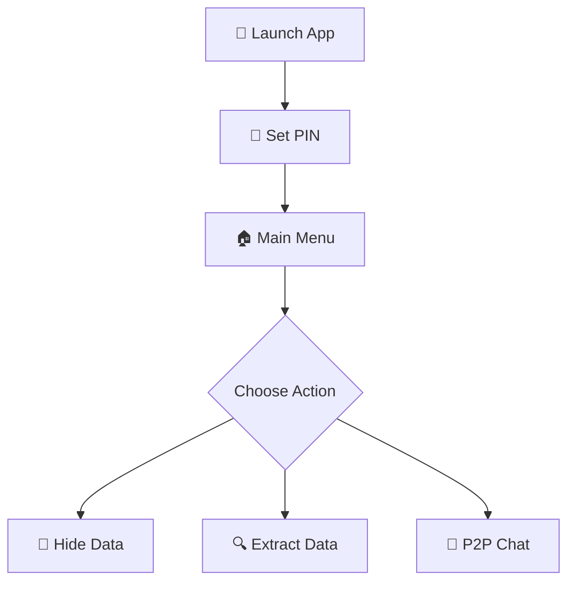
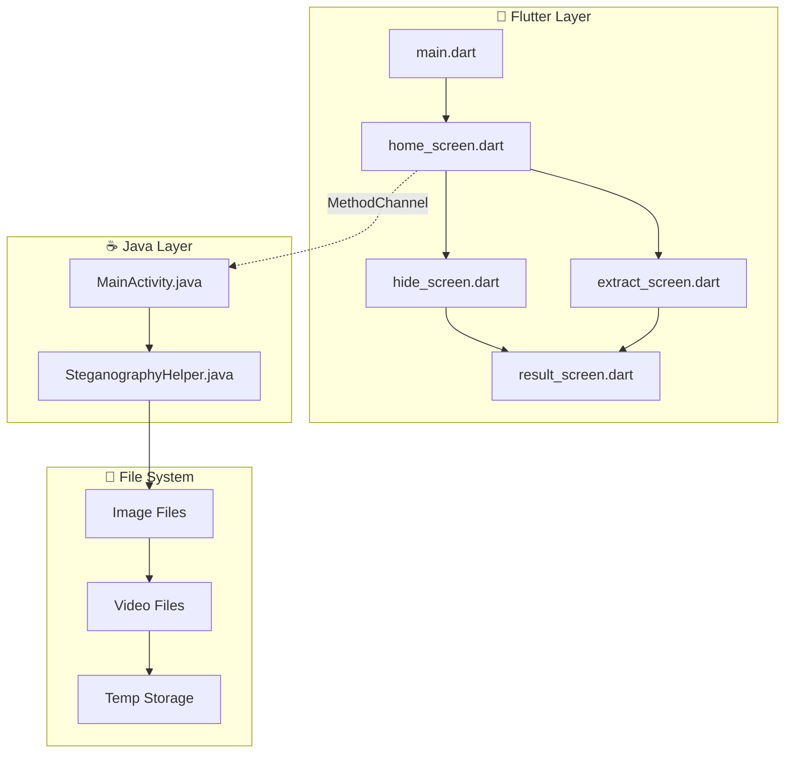

# 🎭 INFIX: Steganography Application

<p align="center">
 
  <br>
  <em>🕵️‍♂️ Hide in Plain Sight • 🔐 Secure by Design • 📱 Encryption Magic</em>
</p>

<div align="center">


</div>

---

## 🎥 Demo


### 🚀 Application Walkthrough
Watch the complete demonstration of INFIX Steganography Application in action:

<div align="center">

[](path/to/your/screen-recording.mp4)

</div>

<details>
<summary>🎬 <strong>Demo Highlights</strong></summary>

- 🔐 PIN authentication setup and usage
- 📝 Text-in-image hiding and extraction process  
- 🖼️ Image-in-image steganography workflow
- 🎥 Video steganography demonstration
- 💬 P2P chat functionality
- ⚡ Real-time processing and results

</details>

---

## ✨ Features

<p align="center">
  
</p>

### 🎯 Core Steganographic Capabilities

<table>
<tr>
<td width="50%">

#### 📝 Text-in-Image

Hide and extract text messages within images using LSB encoding

#### 🖼️ Image-in-Image  

Embed secret images within carrier images with lossless quality

</td>
<td width="50%">

#### 🎥 Image-in-Video

Conceal images within video files using non-keyframe embedding

#### ⚡ Multi-threaded Processing

Optimized performance with parallel processing

</td>
</tr>
</table>

---

### 🌟 Additional Features

<div align="center">

| Feature | Description |
|---------|-------------|
| 🔐 **PIN Authentication** | Secure access control |
| 📡 **Offline P2P Chat** | Local Wi-Fi communication |
| 📱 **Cross-Platform UI** | Flutter responsive interface |
| 🗂️ **Advanced File Management** | Efficient media handling |

</div>

---

## 🛠️ Technologies Used

<div align="center">

### 🎨 Frontend (Flutter)
```
🚀 Framework: Flutter for cross-platform development
📦 Key Packages: file_picker, image_picker, path_provider
🔐 Permissions: permission_handler
```

### ⚙️ Backend (Java)  
```
🧠 Core Engine: Java steganographic processing
🎥 Video APIs: MediaCodec & MediaMuxer
💾 Memory: ByteBuffer optimization
🔄 Threading: ExecutorService management
```

</div>

---


## 🔧 Installation


### 📋 Prerequisites

<div align="center">

| Requirement | Version | Status |
|-------------|---------|--------|
| Flutter SDK | Latest Stable | ✅ |
| Android Studio | Latest | ✅ |
| Java JDK | 8+ | ✅ |
| Device/Emulator | Android/iOS | ✅ |

</div>

### 🚀 Setup Instructions

```bash
# 1️⃣ Clone the Repository
git clone https://github.com/yourusername/infix-steganography.git
cd infix-steganography

# 2️⃣ Install Flutter Dependencies  
flutter pub get

# 3️⃣ Build and Run
flutter run
```

<details>
<summary>📋 <strong>Android Permissions Configuration</strong></summary>

Add to `android/app/src/main/AndroidManifest.xml`:

```xml
<uses-permission android:name="android.permission.READ_EXTERNAL_STORAGE" />
<uses-permission android:name="android.permission.WRITE_EXTERNAL_STORAGE" />
<uses-permission android:name="android.permission.CAMERA" />
<uses-permission android:name="android.permission.ACCESS_WIFI_STATE" />
<uses-permission android:name="android.permission.CHANGE_WIFI_STATE" />
```

</details>

---

## 📖 Usage Guide


### 🏁 Getting Started

<div align="center">



</div>


---

## 🏗️ Architecture


<div align="center">



</div>

---

## 🔒 Security Features


<div align="center">

| Feature | Benefit | Visual |
|---------|---------|--------|
| 🔐 **PIN Protection** | Prevents unauthorized access |  |
| 🏠 **Local Processing** | No internet required |  |
| 🔍 **LSB Encoding** | Virtually undetectable |  |
| ✅ **Data Integrity** | Multiple verification |  |

</div>

---

## ⚡ Performance Optimizations


<div align="center">

### 🚀 Speed Enhancements

```
🔄 Multi-threading    → Parallel CPU core utilization
🧠 Memory Management  → Efficient bitmap recycling  
📦 LZ4 Compression    → Fast, lightweight compression
💾 Smart Caching      → Optimal temporary storage
```

</div>

---

## 🐛 Troubleshooting


<details>
<summary>🚫 <strong>Permission Denied Errors</strong></summary>

- ✅ Grant all required permissions in device settings
- ✅ Verify Android manifest configuration
- ✅ Restart app after permission changes

</details>

<details>
<summary>💾 <strong>Large File Processing</strong></summary>

- 📊 Monitor device memory usage
- ⚡ Process files in smaller chunks
- 🔄 Clear cache regularly

</details>

<details>
<summary>❌ <strong>Extraction Failures</strong></summary>

- ✅ Verify file was created using this app
- 🔍 Check for file corruption
- 📁 Ensure proper file format

</details>

---

## 🚧 Future Enhancements


<div align="center">

| Enhancement | Priority | Status |
|-------------|----------|--------|
| 🎵 Audio File Support | High | 🔄 Planning |
| 🔐 Advanced Encryption | Medium | 🔄 Research |
| ☁️ Cloud Sync | Low | 💭 Concept |
| 📦 Batch Processing | Medium | 📋 Backlog |

</div>

---

## 📊 Technical Specifications

<div align="center">

| Feature | Specification | Visual |
|---------|---------------|--------|
| 📱 **Platforms** | Android, iOS |  |
| 🎨 **Frontend** | Flutter/Dart |  |
| ⚙️ **Backend** | Java |  |
| 📦 **Compression** | LZ4, Deflater/Inflater |  |
| 🔄 **Threading** | Multi-core parallel |  |
| 🔐 **Security** | PIN auth, LSB encoding |  |

</div>

---

<div align="center">


**Built with ❤️ using Flutter and Java**

*🕵️‍♂️ Hide in Plain Sight • 🔐 Secure by Design • 📱 Cross-Platform Magic*

---

 **Thank you for exploring INFIX!** 

</div>
